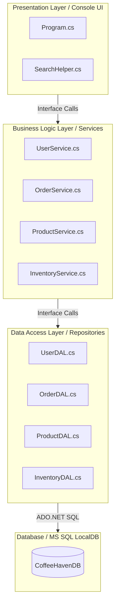
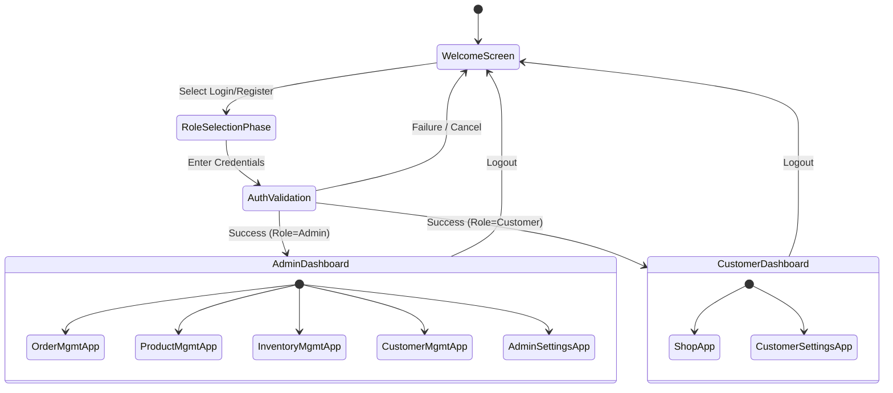
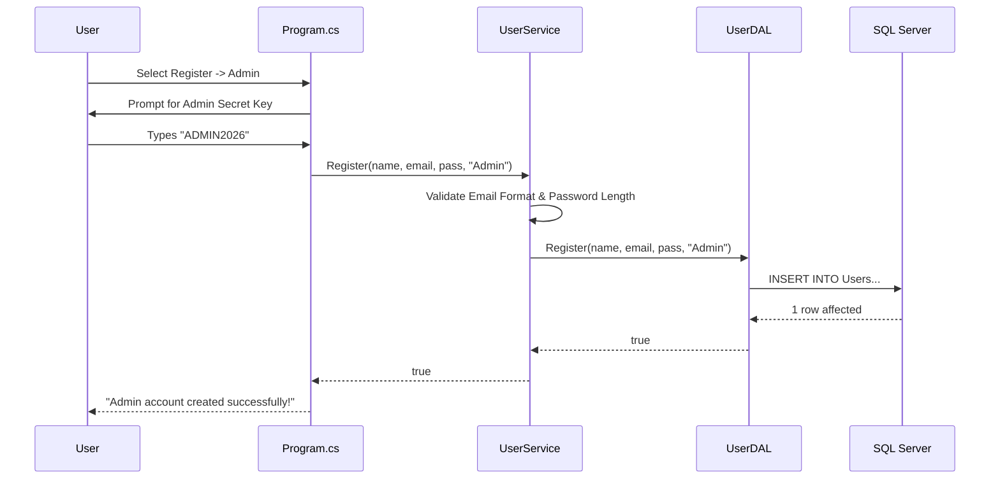
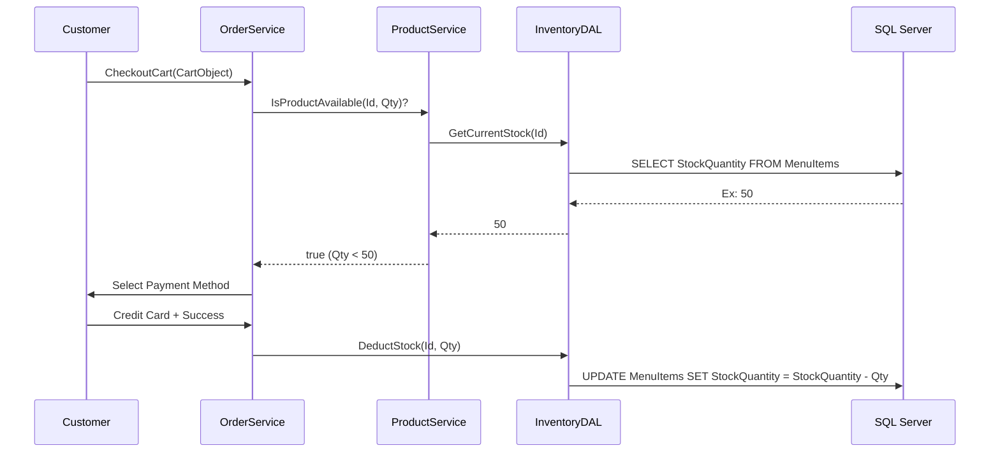
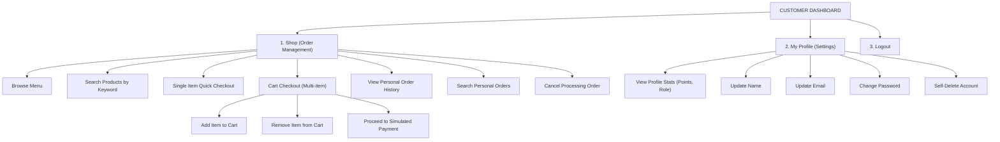

# ☕ Coffee Haven Enterprise Application

## Table of Contents

1. [Project Overview & Business Case](#1-project-overview--business-case)
2. [System Architecture](#2-system-architecture)
3. [Database Schema Definition](#3-database-schema-definition)
4. [High-Level System Workflows](#4-high-level-system-workflows)
5. [Detailed Module Workflows](#5-detailed-module-workflows)
6. [Software Requirements Specification (SRS)](#6-software-requirements-specification-srs)
7. [Software Quality Assurance (SQA) Plan](#7-software-quality-assurance-sqa-plan)
8. [Comprehensive Test Plan](#8-comprehensive-test-plan)
9. [Detailed Test Cases (SQA)](#9-detailed-test-cases-sqa)
10. [Setup & Installation Instructions](#10-setup--installation-instructions)
11. [Associated Documents](#11-associated-documents)

---

## 1. Project Overview & Business Case

Coffee Haven was born out of a need for a unified, scalable, and secure platform to handle the day-to-day operations of a modern, high-volume coffee shop. Traditional systems often separate the Point of Sale (POS) from back-office management, leading to data silos, asynchronous inventory issues, and manual synchronization efforts.

The Coffee Haven Enterprise Application solves this by utilizing a **3-Tier Layered Architecture** (.NET Core C#) directly tied to a transactional SQL Server database. It ensures that when a customer places an order, the inventory is depleted in real-time, order histories are immutably logged, and loyalty points are dynamically updated.

### 1.1 Core Business Value

- **Security First**: Granular Role-Based Access Control (RBAC) ensures Customers cannot view internal metrics, while Admins have full oversight.
- **Data Integrity**: ADO.NET parameterized queries heavily mitigate SQL Injection risks, and strict constraints ensure reliable soft deletes and referential integrity.
- **Streamlined User Experience**: A robust console UI utilizing formatted DataTables, immediate error feedback, and intuitive navigation loops allows rapid training for administrative staff.

---

## 2. System Architecture

The application strictly enforces separation of concerns through three distinct layers.



### 2.1 Layer Responsibilities

1. **Presentation Layer**: Handles user inputs, displays standard headers, formats `DataTable` objects into human-readable grids, and manages the continuous `while(true)` application loops.
2. **Business Logic Layer (BLL)**: Handles heavy validation. E.g., email regex checking, password strength enforcement, calculating total order prices, verifying stock before order approval.
3. **Data Access Layer (DAL)**: Solely responsible for interacting with the raw database. Executes parameterized SQL queries and handles `SqlException` handling.

---

## 3. Database Schema Definition

The underlying database relies heavily on relational constraints to maintain data integrity.

| Table Name               | Description                            | Key Columns                                                                                  |
| ------------------------ | -------------------------------------- | -------------------------------------------------------------------------------------------- |
| **Categories**           | Core grouping for all items.           | `CategoryID` (PK), `CategoryName`, `Description`                                             |
| **MenuItems (Products)** | The actual product catalog.            | `ItemID` (PK), `CategoryID` (FK), `Name`, `Price`, `StockQuantity`, `IsActive` (Soft Delete) |
| **Users**                | Both Admin and Customer accounts.      | `UserID` (PK), `FullName`, `Email` (UNIQUE), `PasswordHash`, `Role`, `LoyaltyPoints`         |
| **Orders**               | High-level transactional records.      | `OrderID` (PK), `UserID` (FK), `OrderDate`, `TotalAmount`, `Status`                          |
| **OrderItems**           | Line-item specific tracking snapshots. | `OrderItemID` (PK), `OrderID` (FK), `ItemID` (FK), `Quantity`, `PriceAtTime`                 |

### 3.1 Important Constraints

- **PriceAtTime Snapshotting**: Inside `OrderItems`, physical `PriceAtTime` is stored. If an Admin updates a coffee price from $4 to $5 tomorrow, historical orders from yesterday will still mathematically display as $4.
- **Soft Deletions**: Rather than permanently deleting MenuItems and breaking Foreign Key connections in `OrderItems`, we use an `IsActive` bit operator.

---

## 4. High-Level System Workflows



---

## 5. Detailed Module Workflows

### 5.1 Registration & Authentication Gateways

To ensure strict boundary controls, Role selection occurs _before_ database querying.



### 5.2 Dynamic Shopping & Inventory Check



### 5.3 Complete Admin Modules Workflow

```mermaid
flowchart TD
    AdminDashboard["ADMIN DASHBOARD"]

    AdminDashboard --> O["1. Order Management"]
    AdminDashboard --> P["2. Product Management"]
    AdminDashboard --> I["3. Inventory Management"]
    AdminDashboard --> C["4. Customer Management"]
    AdminDashboard --> S["5. Settings (Profile)"]
    AdminDashboard --> L["6. Logout"]

    O --> O1["View Active Orders"]
    O --> O2["Process/Update Order Status"]
    O --> O3["Search Order History"]

    P --> P1["View All Products"]
    P --> P2["Search Products"]
    P --> P3["Add New Product"]
    P --> P4["Update Existing Product"]
    P --> P5["Soft-Delete Product (Make Inactive)"]

    I --> I1["View Low Stock (Threshold based)"]
    I --> I2["Search Inventory Ledger"]
    I --> I3["Restock Item (Add Qty)"]

    C --> C1["View All Users"]
    C --> C2["Search / Filter by Role"]
    C --> C3["Add New User (Admin/Customer)"]
    C --> C4["Update User Details"]
    C --> C5["Force Delete User"]

    S --> S1["Update Own Name"]
    S --> S2["Update Own Email"]
    S --> S3["Change Own Password"]
    S --> S4["Delete Own Account"]
```



### 5.4 Complete Customer Modules Workflow



---

## 6. Software Requirements Specification (SRS)

### 6.1 Purpose

This document specifies the technical configurations, system logic, and boundaries for the Coffee Haven Application. This SRS is meant for developers, QA engineers, and system administrators configuring the enterprise environment.

### 6.2 Target Audience & User Personas

1. **Administrators (System Owners / Managers)**: Require full CRUD over inventory, user accounts, and product catalogs. Needs the ability to override user data.
2. **Customers (End Users)**: Require minimal, clean interfaces to browse, search, and purchase coffee. Need secure ways to manage their localized profiles.

### 6.3 Functional Requirements

| Req ID    | Module  | Requirement Description                                                                                                         | Priority |
| --------- | ------- | ------------------------------------------------------------------------------------------------------------------------------- | -------- |
| **FR-01** | Auth    | System shall authenticate users based on Email, Password, and Role triplet.                                                     | Critical |
| **FR-02** | Auth    | System shall require a hardcoded environment secret (`ADMIN2026`) for Admin account initializations.                            | Critical |
| **FR-03** | Product | Admins shall be able to perform physical creation and logical updates of products.                                              | High     |
| **FR-04** | Product | Products shall implement soft-delete strategies to preserve historical ledger records.                                          | High     |
| **FR-05** | Order   | System shall support isolated, atomic checkout transactions for single items and batched carts.                                 | Critical |
| **FR-06** | Inv     | System shall immediately deduct purchased inventory quantities from active store stocks upon successful simulated transactions. | Critical |
| **FR-07** | Cust    | Admins shall be able to view, search, modify, and forcefully delete targeted consumer accounts.                                 | Med      |
| **FR-08** | Profile | Consumers shall be allowed to modify their Email and Name profiles self-service.                                                | High     |
| **FR-09** | Profile | Password modifications and self-account annihilations shall mandate current-password reverification gates.                      | Critical |

### 6.4 Non-Functional Requirements

1. **Security**: All SQL calls must natively implement parameterization. Concat string SQL queries are strictly prohibited due to severe injection vulnerabilities.
2. **Stability constraints**: Application crashes derived from DBNull mapping (e.g. empty Loyalty points) must be handled natively by ternary fallback operators.
3. **Auditability**: Order lines must preserve historical `PriceAtTime` snapshots instead of dynamic joins.

---

## 7. Software Quality Assurance (SQA) Plan

### 7.1 Scope & Purpose

The SQA plan encompasses all structured unit testing, functional UI testing, and boundary system testing for the enterprise app. It aims to prevent fatal software regressions whenever the Presentation layer or Data Access schemas are upgraded.

### 7.2 Quality Standards

- **Defect Tracking**: All bugs must be logged. Critical bugs (Null Reference Exceptions breaking UI loops) hold project launch. Medium bugs (formatting overlaps) are addressed post-sprint.
- **Code Structuring**: BLL methods must ALWAYS validate payloads before pinging the DAL. The DAL should only ever handle SQL, connection strings, and parameters.

### 7.3 Risk Mitigation

- **Database Corruption Risk**: Mitigated by providing initial setup scripts (`SQLQuery1`, `SQLQuery2`, `SQLQuery3_AddRole`).
- **Memory Leak Risk**: ADO.NET connections explicitly utilize `using` blocks to enforce synchronous garbage collection and port disposal.

---

## 8. Comprehensive Test Plan

### 8.1 Test Approach

Testing will primarily be manual, exploratory System Integration Testing (SIT) leveraging the active console UI communicating against localized `(localdb)` instances.

### 8.2 Testing Levels

1. **Sanity Testing**: Basic verifications. Does the application build successfully without errors? Does it turn on?
2. **Functional Testing**: Verifying every FR documented in Section 6.3.
3. **Negative/Boundary Testing**: Entering negative integer amounts during restocks, skipping mandatory fields, intentionally failing passwords.

### 8.3 Entry and Exit Criteria

- **Entry**: Code executes with zero MSBuild compilation compiler errors. SQL scripts have been successfully injected into the localdb instance.
- **Exit**: All 20 defined primary functional test cases result in PASSED status. Zero unhandled fatal exceptions.

---

## 9. Detailed Test Cases (SQA)

### 9.1 Authentication & Registration Modules

| TC#        | Scenario                       | Pre-Condition                   | Steps to Execute                                                           | Expected Result                                                       | Status  |
| ---------- | ------------------------------ | ------------------------------- | -------------------------------------------------------------------------- | --------------------------------------------------------------------- | :-----: |
| **TC-001** | Standard Customer Login        | Customer 'cust@abc.com' exists  | 1. Select Login. 2. Role=Customer 3. Enter Email=cust@abc.com, Pass=123456 | User is authenticated and routed to Customer Dashboard.               | PENDING |
| **TC-002** | Role Gate Validation           | cust@abc.com exists as Customer | 1. Select Login. 2. Role=Admin 3. Enter Email=cust@abc.com, Pass=123456    | System explicitly denies login, stating no "Admin" account found.     | PENDING |
| **TC-003** | Failed Admin Auth Registration | None                            | 1. Select Register. 2. Role=Admin. 3. Enter Secret Key='hello'             | Registration denied immediately; skips name/password collection.      | PENDING |
| **TC-004** | Valid Admin Registration       | None                            | 1. Select Register. 2. Role=Admin. 3. Key='ADMIN2026'. 4. Complete fields. | Success message displays. Account inserted into DB with 'Admin' Role. | PENDING |
| **TC-005** | Auth Field Empty Validation    | None                            | 1. Login. 2. Leave email blank, hit Enter.                                 | BLL catches empty inputs. Displays "Email/Password cannot be empty".  | PENDING |

### 9.2 Profile & Security Modules (Settings)

| TC#        | Scenario                        | Pre-Condition      | Steps to Execute                                          | Expected Result                                                      | Status  |
| ---------- | ------------------------------- | ------------------ | --------------------------------------------------------- | -------------------------------------------------------------------- | :-----: |
| **TC-006** | View Profile Rendering          | Logged in as Admin | 1. Admin Dash -> Settings. 2. View Profile                | Displays Name, Email, Role='Admin', Loyalty=0+. Data matches DB.     | PENDING |
| **TC-007** | Change Name Updates DB          | Logged in          | 1. Settings -> Update Name. 2. Enter "New Zain".          | Success. Next query of View Profile reflects "New Zain".             | PENDING |
| **TC-008** | Change Password Short Length    | Logged in          | 1. Change Pass. 2. Current=correct. 3. New="123"          | BLL rejects. "New password must be at least 6 characters long."      | PENDING |
| **TC-009** | Change Password Same as Old     | Logged in          | 1. Change Pass. 2. Current='password'. 3. New='password'  | BLL rejects. "Must be different from current password."              | PENDING |
| **TC-010** | Delete Account Invalid Password | Logged in          | 1. Delete Account. 2. Type DELETE. 3. Enter wrong pass.   | Account deletion aborted. User remains active.                       | PENDING |
| **TC-011** | Customer Delete Account Success | Logged in          | 1. Delete Account. 2. Type DELETE. 3. Enter Correct Pass. | Success. Session wiped. User row deleted. Returns to Welcome Screen. | PENDING |

### 9.3 Product & Inventory Modules (Admin)

| TC#        | Scenario                  | Pre-Condition         | Steps to Execute                                              | Expected Result                                                        | Status  |
| ---------- | ------------------------- | --------------------- | ------------------------------------------------------------- | ---------------------------------------------------------------------- | :-----: |
| **TC-012** | View Low Stock Report     | Inventory active      | 1. Inventory Mgmt. 2. View Low Stock. 3. Enter Threshold '10' | Datatable renders ONLY items with StockQuantity < 10.                  | PENDING |
| **TC-013** | Negative Quantity Restock | Item exists           | 1. Inv Mgmt. 2. Restock. 3. Enter Qty=-50                     | BLL/UI validation rejects immediately. "Must be greater than zero."    | PENDING |
| **TC-014** | Add Product Missing Name  | Categories exist      | 1. Prod Mgmt -> Add. 2. Name is empty space.                  | BLL blocks creation payload.                                           | PENDING |
| **TC-015** | Product Keyword Search    | Prod 'Caramel' exists | 1. Prod Mgmt -> Search. 2. Keyword="caram"                    | Engine isolates rows. SearchHelper triggers case-insensitive match.    | PENDING |
| **TC-016** | Soft Delete Product       | Prod exists           | 1. Prod Mgmt -> Delete. 2. Pick 'Caramel'. Confirm Y.         | Product IsActive=0. It no longer appears in Customer browsing context. | PENDING |

### 9.4 Shopping Flow & Checkout Core Modules

| TC#        | Scenario                 | Pre-Condition           | Steps to Execute                                      | Expected Result                                                         | Status  |
| ---------- | ------------------------ | ----------------------- | ----------------------------------------------------- | ----------------------------------------------------------------------- | :-----: |
| **TC-017** | Add to Cart Validation   | Product has 5 units     | 1. Shop -> Cart Checkout -> Add Item. 2. Qty=10.      | Allowed to add to cart, BUT delayed validation catches it.              | PENDING |
| **TC-018** | Single Item Checkout OOS | Product has 0 units     | 1. Shop -> Single Item Checkout. 2. Pick Item, Qty=1. | Immediate rejection: "Only 0 units available."                          | PENDING |
| **TC-019** | Successful Cart Payment  | Valid Items in Cart     | 1. Cart Checkout. 2. Proceed. 3. Select Card.         | Simulated success. Total order mapped. Stock dynamically depleted down. | PENDING |
| **TC-020** | Order History DB Mapping | Placed Order previously | 1. Order Mgmt -> View History                         | Display shows accurate total amount, OrderID, matching user token.      | PENDING |

### 9.5 Customer Management (Admin Panel)

| TC#        | Scenario                       | Pre-Condition      | Steps to Execute                                   | Expected Result                                                                   | Status  |
| ---------- | ------------------------------ | ------------------ | -------------------------------------------------- | --------------------------------------------------------------------------------- | :-----: |
| **TC-021** | View Null Loyalty Point Safely | User with NULL pts | 1. Cust Mgmt -> View All Users.                    | DataTable loops cleanly. DBNull catches logic and displays '0'. No raw crash.     | PENDING |
| **TC-022** | Filter by Customer Role        | Mixed user base    | 1. Cust Mgmt -> Search/Filter -> Role -> Customer. | SearchHelper.FilterDataTable displays ONLY customer records.                      | PENDING |
| **TC-023** | Admin Updating Cust Email      | User ID=2 exists   | 1. Cust Mgmt -> Update User -> Pick 2 -> Email.    | DB processes UPDATE SET Email...                                                  | PENDING |
| **TC-024** | Admin Self Delete Prevent      | Admin ID=1         | 1. Cust Mgmt -> Delete User -> Pick ID 1.          | System overrides, displaying "Cannot delete own account from here. Use Settings." | PENDING |
| **TC-025** | Debug Screen Renders           | Any users          | 1. Welcome Screen -> 3. View Accounts (Debug).     | Renders table showing raw User Data + Passwords cleanly.                          | PENDING |

---

## 10. Setup & Installation Instructions

To orchestrate and launch this workspace locally, follow these strict directives:

### 10.1 Database Initialization

Due to the ADO.NET native integrations mapping to Microsoft SQL Server Data Tools, the application relies on an `.mdf` local database.

1. Locate the attached `.sql` query files dynamically nested in `c:\Users\User\source\repos\CoffeeHavenApp\CoffeeHavenApp\queries\`
2. Open **SQL Server Management Studio (SSMS)** or Visual Studio's **SQL Server Object Explorer**.
3. Target your `(localdb)\MSSQLLocalDB` instance.
4. Execute them in strict sequential chronological order:
   - `SQLQuery1.sql` (Scaffolds Core tables, adds Soft Deletes)
   - `SQLQuery2.sql` (Creates Enterprise schema, injects seed constraints)
   - `SQLQuery3_AddRole.sql` (Extends schema for Role-Based Action controls)

### 10.2 Compilation Details

Ensure an active `.NET SDK` (targeting version 8.0/10.0 per project properties) is configured.

To compile:

```bash
# Navigate to the repository root
cd CoffeeHavenApp

# Clean persistent binaries
dotnet clean

# Execute core MSBuild compilations
dotnet build

# Initialize runtime environment
dotnet run
```

### 10.3 Default Login Matrix

If the SQL scripts were seeded natively, the following accounts exist dynamically:

- **Admin Account**:
  - Login: `zain@coffeehaven.com`
  - Pass: `default_hash_123`
  - _Note: You can initialize additional admins using the `ADMIN2026` secret switch during registration phase._

- **Standard Customer Accounts**:
  - Must be created dynamically upon first boot using `1. Register` prompt on the Main Screen.
  - Alternately, use the newly architected `Debug View` screen to view automatically generated backend user lists alongside their passwords.

### 10.4 Maintenance & Troubleshooting

If you encounter `SqlException` triggers:

1. Verify the `AppDomain.CurrentDomain.SetData("DataDirectory", ...);` string is actively bridging the `.mdf` file stringly referenced in the `DAL` classes.
2. Confirm you executed `SQLQuery3_AddRole.sql`. If columns are missing, standard queries throwing `Invalid Column Name` will appear on the terminal feedback string.

---

## 11. Associated Documents

_Please attach or link relevant collaborative documents here:_

- **Project Documentation GoogleDocs File**: [[Click me](https://docs.google.com/document/d/12uixH9_1oMVT-7_ZZ3e9d-J6t6gbToQqs0qFqkdSu30/edit?usp=sharing)]

---

_Coffee Haven Enterprise: Developed internally for optimal performance, scalability, and console-environment reliability._
